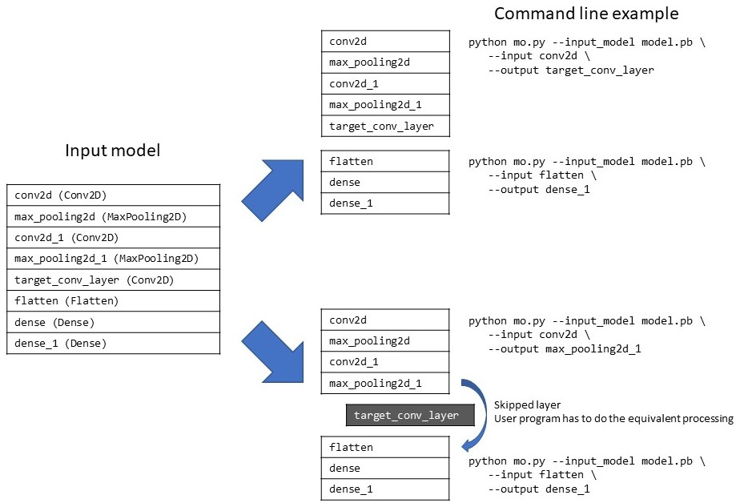
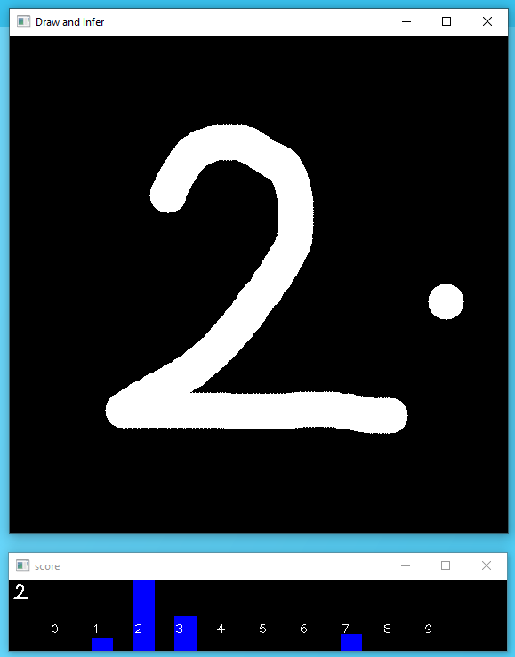

# Demonstration of OpenVINO techniques - Model-division and a simplest-way to support custom layers  


### Description:  
 `Model Optimizer` in Intel(r) OpenVINO(tm) toolkit supports model division function. User can specify the region in the model to convert by specifying entry point and exit point with `--input` and `--output` options respectively.  
 The expected usage of those options are:  
 - **Excluding unnecessary layers:** Removing non-DL related layers (such as JPEG decode) and layers not required for inferencing (such as accuracy metrics calculation)  
 - **Load balancing:** Divide a model into multiple parts and cascade them to get the final inferencing result. Each individual part can be run on different device or different timing.  
 - **Access to the intermediate result:** Divide a model and get the intermediate feature data to check the model integrity or for the other purposes.  
 - **Exclude non-supported layers:** Convert the model without OpenVINO non-supprted layers. Divide the model and skip non-supported layers to get the IR models. User needs to perform the equivalent processing for the excluded layers to get the correct inferencing result.  

This project demonstrates how to divide a DL model, and fill the hole for skipped leyers.  
The project includes Python and C++ implementations of **naive** 2D convolution layer to perform the Conv2D task which was supposed to have done by the skipped layer. This could be a good reference when you need to implement a custom layer function to your project but don't want to develop full-blown OpenVINO custom layers due to some restrictions such as development time.  



### Prerequisites:  
- TensorFlow 2.x  
- OpenVINO 2021.4 (2021.x may work)  


### How to train the model and create trained model files  
You can train the model by just kicking the `training.py` script. `training.py` will use `keras.datasets.mnist` as the training and validation dataset and train the model, and then save the trained model in `SavedModel` format.  
`training.py` also generates `weights.npy` file that contains the weight and bias data of `target_conv_layer` layer. This weight and bias data will be used by the special made Conv2D layer.  

```sh
python3 training.py
```

### How to convert a TF trained model into OpenVINO IR model format  
  `Model Optimizer` in OpenVINO converts TF (savedmodel) model into OpenVINO IR model.  
  Here's a set of script to convert the model for you.  

|script|description|
|----|----|
|convert-normal.sh|Convert entire model and generate single IR model file (no division)|
|convert-divide.sh|Divide the input model and output 2 IR models. All layers are still contained (no skipped layers)|
|convert-divide-skip.sh|Divide the input model and skip 'target_conv_layer'|
- The converted models can be found in `./models` folder.  

### Tip to find the correct node name for Model Optimizer

Model optimizer requires **MO internal [networkx](https://networkx.org/) graph node name** to specify `--input` and `--output` nodes. You can modify the model optimizer a bit to have it display the list of networkx node names. Add 3 lines on the very bottom of the code snnipet below and run the model optimizer.  

`mo/utils/class_registration.py`
```python
def apply_replacements_list(graph: Graph, replacers_order: list):
    """
    Apply all transformations from replacers_order
    """
    for i, replacer_cls in enumerate(replacers_order):
        apply_transform(
            graph=graph,
            replacer_cls=replacer_cls,
            curr_transform_num=i,
            num_transforms=len(replacers_order))
        # Display name of available nodes after the 'loader' stage
        if 'LoadFinish' in str(replacer_cls):
            for node in graph.nodes():
                print(node)
```

You'll see something like this. You need to use one of those node names for `--input` and `--output` options in MO.  
```sh
conv2d_input
Func/StatefulPartitionedCall/input/_0
unknown
Func/StatefulPartitionedCall/input/_1
StatefulPartitionedCall/sequential/conv2d/Conv2D/ReadVariableOp
StatefulPartitionedCall/sequential/conv2d/Conv2D
   :   (truncated)   :
StatefulPartitionedCall/sequential/dense_1/BiasAdd/ReadVariableOp
StatefulPartitionedCall/sequential/dense_1/BiasAdd
StatefulPartitionedCall/sequential/dense_1/Softmax
StatefulPartitionedCall/Identity
Func/StatefulPartitionedCall/output/_11
Func/StatefulPartitionedCall/output_control_node/_12
Identity
Identity56
```

### How to infer with the models on OpenVINO  
Several versions of scripts are available for the inference testing.  
|script|description|
|----|----|
|inference.py|Use simgle, monolithic IR model and run inference|
|inference-div.py|Take 2 divided IR models and run inference. 2 models will be cascaded.|
|inference-skip-python.py|Tak2 2 divided IR models which excluded the 'target_conv_layer'. Program is including a Python version of Conv2D and perform convolution for 'target_conv_layer'. **VERY SLOW.** |
|inference-skip-cpp.py|Tak2 2 divided IR models which excluded the 'target_conv_layer'. Program imports a Python module written in C++ which includes a C++ version of Conv2D. Reasonably fast. Conv2D Python extension module is required. Please refer to the following section for details.|

### How to build the Conv2D C++ Python extnsion module  
You can build the Conv2D C++ Python extension module by running `build.sh` or `build.bat`.  
`myLayers.so` or `myLayers.pyd` will be generated and copied to the current directory after a successful build.  


### How to run `draw-and-infer` demo program  
Here's a simple yet bit fun demo application for MNIST CNN. You can draw a number on the screen by mouse or finger-tip and you'll see the real-time inference result.  Right-click will clear the screen for another try. Several versions are available.  
|script|description|
|----|----|
|draw-and-infer.py|Use the monolithic IR model|
|draw-and-infer-div.py|Use divided IR models|
|draw-and-infer-skip-cpp.py|Use divided IR models which excluded 'target_conv_layer'. Conv2D Python extension is requird.|



### Tested environment
- Windows 10 + VS2019 + OpenVINO 2021.4
- Ubuntu 20.04 + OpenVINO 2021.4
